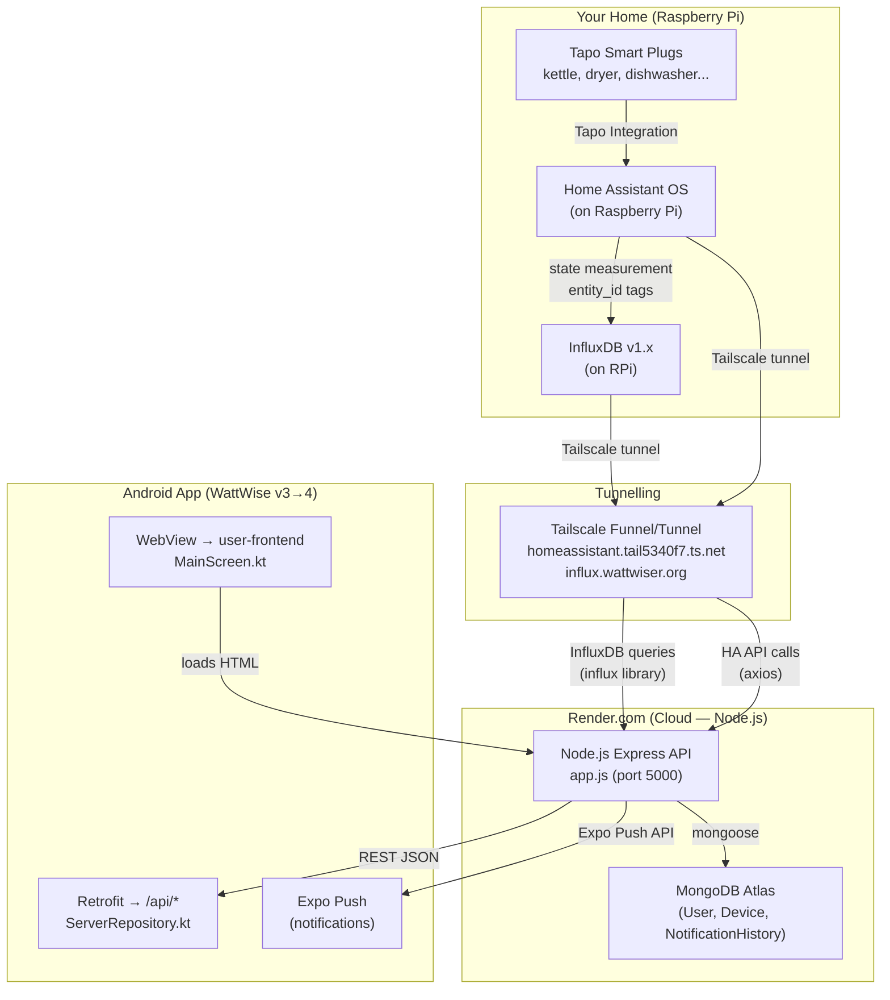
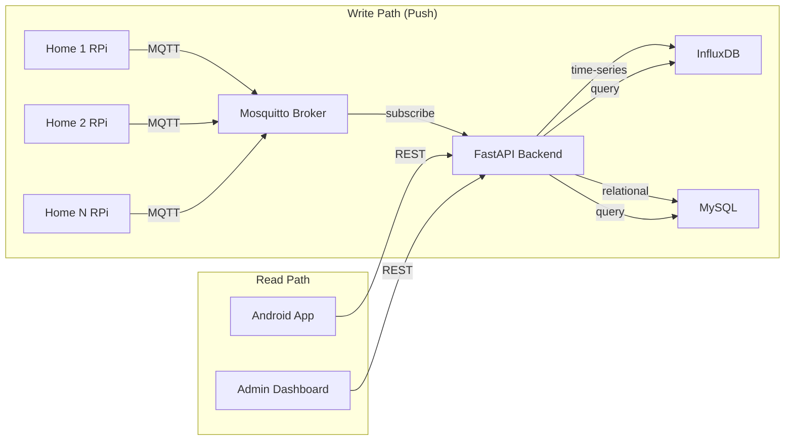
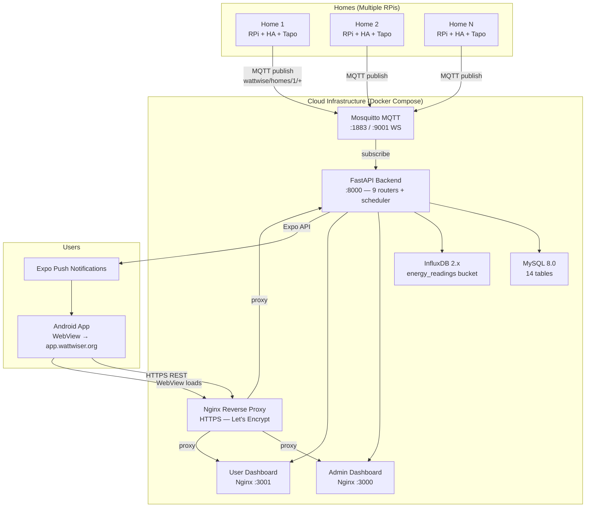

# WattWise — Full Architecture Analysis & Community Migration Plan

> **Developer:** Mr. Suhas Devmane, Cardiff University, Wales, UK  
> **Research Context:** PhD Research — Community-Level Energy Decision-Making  
> **Last Updated:** March 2026

---

## 1. Current Architecture (Single-Home / Single-User)

### How It Works End-to-End



### Layer Breakdown

| Layer              | Technology               | Purpose                                                                       | Where it Runs             |
| ------------------ | ------------------------ | ----------------------------------------------------------------------------- | ------------------------- |
| **Sensing**        | TP-Link Tapo Smart Plugs | Power (W), current (A), energy (kWh) per appliance                            | Your home                 |
| **Gateway**        | Home Assistant OS        | Collects Tapo data, exposes entity states via REST API                        | Raspberry Pi              |
| **Time-Series DB** | InfluxDB v1.x            | `"state"` measurement tagged by `entity_id`                                   | Raspberry Pi              |
| **Tunnelling**     | Tailscale Funnel         | Exposes `influx.wattwiser.org` + `homeassistant.tail*` to internet            | RPi → Internet            |
| **API Backend**    | Node.js Express 5        | Queries InfluxDB + HA API, serves REST endpoints, runs notification scheduler | Render.com                |
| **User Data**      | MongoDB (Atlas)          | Users, devices, rooms, notification history (7-day TTL)                       | Cloud (Atlas)             |
| **Mobile App**     | Kotlin + Jetpack Compose | WebView → user-frontend HTML; native splash, settings, push token             | User's phone              |
| **Notifications**  | Expo Push API            | Energy spikes, peak tariff reminders, optimization alerts                     | Render.com → Expo → phone |

---

### Root-Level Node.js Files (Deployed on Render.com)

| File                                     | Purpose                                                                                                                 |
| ---------------------------------------- | ----------------------------------------------------------------------------------------------------------------------- |
| `app.js`                                 | Express gateway: MongoDB connect, InfluxDB client init, HA headers, cron scheduler start, `/api/ingest-data`, `/health` |
| `model/user-model.js`                    | Mongoose `User` schema — embedded `Device[]` (entityId, powerEntityId, switchEntityId) and `Room[]`                     |
| `model/notification-history-model.js`    | `NotificationHistory` with optimization factors (fT/fH/fP), usage data (EAEC, N, duration), 7-day TTL                   |
| `routes/user-routes.js`                  | 28+ endpoints: auth, device CRUD, device data, room environment, notification history, push tokens                      |
| `controllers/user-controller.js`         | 2528 lines: signup/login (JWT 7d), auto entity-id generation, InfluxDB queries (hourly/daily/historical)                |
| `services/energy-calculator.js`          | Scenario engine: `APPLIANCE_SCENARIOS`, environmental factors (fT/fH/fP), efficiency loss calculation                   |
| `services/notification-scheduler.js`     | Cron: hourly + 30-min peak (4–7pm). Per-user: room conditions → device usage → optimization → dedup (12h) → Expo        |
| `services/push-notification-services.js` | Expo Push API: unique `notificationId` + Android `tag` (prevents stacking), bulk send support                           |

---

### How the Android App Works

The app is a **WebView wrapper** with native infrastructure:

1. **Splash** → animated WattWise ⚡ logo → navigates to `MainScreen`
2. **MainScreen** → `WebView` loads `fullUrl` (e.g. `https://app.wattwiser.org`)
3. **ServerRepository** → combines DataStore URL + port → Retrofit HEAD test for connectivity
4. **Settings** → user changes server URL/port, saved in Preferences DataStore
5. **Push Notifications** → Expo token sent via `POST /api/auth/push-token`

> **Key design:** The app is NOT a native REST consumer. All dashboard UI is served as HTML from the backend. This means dashboard updates don't require Play Store releases — only backend deployment.

---

### Data Flow: Tapo Plug → User Notification

```
Tapo Plug (10s intervals)
  → Home Assistant (entity state update)
    → InfluxDB "state" measurement (entity_id tag)
      → [Tailscale tunnel] → Render.com Node.js
        → notification-scheduler (cron every hour)
          → queries InfluxDB for device usage (EAEC, N, duration)
          → energy-calculator computes optimization (fT × fH × fP)
          → deduplication check (12h per device per notification type)
          → push-notification-service → Expo Push API
            → Android app receives push → deep-link to dashboard
```

---

## 2. Database Storage Strategy

### Current (Single-Home)

| Store               | Data                                                  | Query Pattern                   |
| ------------------- | ----------------------------------------------------- | ------------------------------- |
| **InfluxDB** (RPi)  | `"state"` measurement, `entity_id` tag, `value` field | Time-range queries per entity   |
| **MongoDB** (Atlas) | Users, embedded devices/rooms, notification history   | User lookup, notification dedup |

### Proposed (Community-Level, Dual-DB)

| Store              | Data                                                                           | Why                                                   |
| ------------------ | ------------------------------------------------------------------------------ | ----------------------------------------------------- |
| **InfluxDB Cloud** | All homes' time-series data tagged by `home_id` + `entity_id`                  | Scalable, per-home isolation via tags                 |
| **MySQL**          | Users, homes, devices, goals, user_decisions, rankings, hourly/daily summaries | Relational — joins for rankings, PhD research queries |
| **MongoDB** (keep) | Legacy notification history, backward compat                                   | Gradual migration, keep existing data intact          |



---

## 3. Community-Level Architecture Upgrade

### What Changes

| Component          | Current (Single-Home)                     | Community (Multi-Home)                                                            |
| ------------------ | ----------------------------------------- | --------------------------------------------------------------------------------- |
| **Data ingestion** | Tailscale tunnel → Node.js pulls InfluxDB | MQTT — each RPi **pushes** to `wattwise/homes/{home_id}/devices/{device_id}/data` |
| **Backend**        | Node.js Express on Render.com             | FastAPI on Docker (`Server Side/backend/`)                                        |
| **User DB**        | MongoDB (embedded devices)                | MySQL (relational — supports rankings, goals, decisions)                          |
| **Notifications**  | Node.js cron → EnergyCalculator → Expo    | FastAPI scheduler (7 jobs) → notification_engine.py → Expo                        |
| **Admin**          | None                                      | Admin Dashboard (owner-frontend) — broadcast, export, rankings                    |
| **Rankings**       | None                                      | Community leaderboard: daily/weekly/monthly efficiency scoring                    |
| **Goals**          | None                                      | Per-user energy goals (daily/weekly/monthly kWh targets)                          |
| **Decisions**      | None                                      | PhD research: Accept/Defer/Reject on notifications, effectiveness tracking        |
| **Android app**    | WebView → Node.js HTML                    | WebView → FastAPI user-frontend (:3001)                                           |
| **CI/CD**          | Manual deploy to Render.com               | GitHub Actions → Docker images → GHCR → SSH deploy                                |

### Target Architecture Diagram



---

## 4. Implementation Status

### ✅ Already Built (`Server Side/` folder)

| Component                   | Files                               |
| --------------------------- | ----------------------------------- |
| Docker Compose stack        | `docker-compose.yml`                |
| FastAPI backend (9 routers) | `backend/app/`                      |
| MQTT ingestion              | `mqtt_client.py`                    |
| Energy analysis engine      | `energy_analysis.py`                |
| Decision tracker (PhD)      | `decision_tracker.py`               |
| Notification engine         | `notification_engine.py`            |
| Scheduler (7 cron jobs)     | `scheduler.py`                      |
| Admin + User Dashboards     | `owner-frontend/`, `user-frontend/` |
| MySQL schema (14 tables)    | `mysql/init/01-schema.sql`          |
| Alembic migrations          | `backend/alembic/`                  |
| Nginx + Dockerfiles         | Both frontends                      |
| CI/CD pipeline              | `.github/workflows/ci-cd.yml`       |
| Admin data export CSV/JSON  | `routers/export.py`                 |
| Android full rebrand        | Kotlin sources + Gradle             |

### 🔧 Implemented in This Session

| Item                           | Files                                                                                    |
| ------------------------------ | ---------------------------------------------------------------------------------------- |
| **RPi MQTT publisher**         | `Sensing Layer/rpi_mqtt_publisher.py` (+ `rpi_publisher_config.yaml`, `systemd service`) |
| **MQTT authentication**        | `Server Side/mosquitto/config/mosquitto.conf` (password_file enabled)                    |
| **MQTT password setup**        | `Server Side/mosquitto/scripts/setup_mqtt_passwords.sh`                                  |
| **HTTPS Nginx reverse proxy**  | `Server Side/nginx-proxy/nginx.conf` + `Dockerfile`                                      |
| **Docker Compose update**      | Added nginx-proxy service with auto cert                                                 |
| **Admin bcrypt password**      | `Server Side/mysql/init/01-schema.sql` (script to generate + placeholder guidance)       |
| **Production `.env` template** | `Server Side/.env.production.template`                                                   |
| **Android developer details**  | `Constants.kt` updated, `AboutScreen.kt` new screen                                      |
| **Node.js → FastAPI bridge**   | `Server Side/migration-bridge/` (Nginx proxy routes)                                     |
| **Android push handler**       | `WattWisePushReceiver.kt` + `MainViewModel` deep-link                                    |

---

## 5. Migration Plan: Single-Home → Community

### Phase A — RPi MQTT Publisher (Each Home)

Each RPi runs `rpi_mqtt_publisher.py` (systemd service). Reads local InfluxDB every 30s, publishes to cloud MQTT:

```
wattwise/homes/{HOME_ID}/devices/{ENTITY_ID}/data
payload: { power_watts, current_amps, voltage, energy_kwh, timestamp }
```

This **replaces** Tailscale tunnels.

### Phase B — Cloud Deployment

1. Deploy Docker Compose to cloud VM (DigitalOcean / AWS)
2. DNS: `api.wattwiser.org`, `admin.wattwiser.org`, `app.wattwiser.org`
3. Auto-HTTPS via nginx-proxy + Let's Encrypt
4. Set credentails in `.env` (see `.env.production.template`)

### Phase C — Android App Update

- `DEFAULT_SERVER_URL = "https://app.wattwiser.org"` in `Constants.kt`
- Build release APK v4.0.0
- WebView loads new user dashboard from cloud

### Phase D — User Onboarding

1. Admin creates home → generates MQTT credentials
2. User signs up → assigned to home → RPi publisher configured
3. Data flows cloud → notifications, goals, rankings activate

### Phase E — Decommission Node.js (Render.com)

After all users migrated, remove Render.com service.

---

## 6. Key Design Decisions

| Decision                         | Rationale                                                                           |
| -------------------------------- | ----------------------------------------------------------------------------------- |
| **MQTT push vs. Tailscale pull** | Fire-and-forget; scales to N homes without N tunnels                                |
| **FastAPI over Node.js**         | Async Python, built-in OpenAPI docs, ideal for PhD data analysis                    |
| **MySQL + InfluxDB dual-DB**     | Relational for rankings/goals/decisions; time-series for raw telemetry              |
| **WebView Android app**          | Dashboard updates without Play Store releases                                       |
| **Backward compat aliases**      | `IAATheme`, `IAANavGraph`, `IAAApiService` — no compilation breaks during migration |
| **systemd on RPi**               | Auto-restart publisher on boot/crash, no manual intervention needed                 |

---

## 7. Developer & Research Credits

| Field           | Details                                          |
| --------------- | ------------------------------------------------ |
| **Developer**   | Mr. Suhas Devmane                                |
| **Institution** | Cardiff University, Wales, UK                    |
| **School**      | School of Computer Science & Informatics (COMSC) |
| **Research**    | PhD — Asma Irfan                                 |
| **System**      | WattWise — Smart Home Energy Monitoring Platform |
| **Version**     | 4.0.0 (Community Release)                        |
| **Contact**     | Cardiff University                               |

---

## 8. WattWise 4.0 System Pros & Professional Capabilities

The WattWise 4.0 system has been designed by a professional developer unit to meet high-end enterprise and research standards. Below are the core capabilities and systemic strengths of the fully migrated architecture:

### 1. Robust Containerized Infrastructure
- **Microservices Architecture:** Fully containerised environment using Docker Compose isolates MySQL, Mosquitto, InfluxDB, the FastAPI backend, and Nginx reverse proxies, guaranteeing runtime consistency.
- **Automated Self-Healing:** Systemd integration on Raspberry Pi nodes and Docker restart policies ensure the system recovers autonomously from power or network failures.
- **Reverse Proxy & Load Balancing:** Nginx manages all incoming domain traffic, handling WebSockets for MQTT and HTTPS/SSL certification (via Certbot/Let's Encrypt), forwarding requests cleanly to internal ports `:8000`, `:3000`, and `:3001` over securely isolated Docker networking.

### 2. High-End Administrative Command Centre
- **Complete Overview & Control:** The Admin Portal (Next.js) provides a real-time, global view of the entire smart community, tracking overall consumption, grid usage, and individual home performances.
- **Cross-Home Comparative Analytics:** Allows administrators to stack user performances against each other seamlessly across custom periods (hours/days/months/years).
- **Automated Persona Classification:** Users are dynamically segmented into profiles (e.g., *Eco-Champion*, *Peak-Time Heavy*) based on their calculated efficiency scores, standard deviations, and reaction to actionable notifications.
- **Bulk Operations:** Admins can trigger bulk notification broadcasts, database exports (JSON/CSV), trigger password resets, and manually run complex ML classifier algorithms on community data.

### 3. Advanced Energy Analytics Suite
- **Anomaly Detection:** Utilises Z-Score standard deviation tracking to instantly flag abnormal energy spikes or sudden drops, triggering critical alerts.
- **Rolling Bill Predictions:** 7-day rolling window extrapolation dynamically projects end-of-month electricity bills based on live consumption behaviour and multi-tiered UK Grid tariffs (standard/peak/off-peak).
- **Live Carbon Footprint Tracking:** Converts raw kWh data into CO₂e factors tied to live UK grid carbon intensity, giving users tangible environmental impact tracking.

### 4. Enterprise-Grade Security
- **Strict Security Pipelines:** The system will fail to boot if default development passwords are used in production (`STRICT_SECURITY=true`), forcing enterprise credential compliance.
- **Hardened IoT Telemetry:** The Mosquitto broker strictly checks incoming Raspberry Pi connections against an encrypted `.htpasswd` file mounted deeply into the container.
- **Stateless Authentication:** JSON Web Token (JWT) architecture propagates securely through the middleware (`request.state.user_id`), standardising access controls without blocking async routines.
- **Data Redundancy:** A dedicated database backup container initiates chron-based SQL dumps hourly/daily to prevent any catastrophic data loss.

### 5. Smart Home User Experience
- **Progressive Dashboards:** Users engage with a highly rich, dynamic interface built using modern React/Next.js frameworks displaying vibrant, interactive charts and KPI metric tiles.
- **Push Native Actionability:** Android applications leverage Expo Push to deliver rich alerts that deep-link straight to the user's portal, directly influencing behaviour and immediately logging the user's decision (Tracker PhD Model) into the database.
