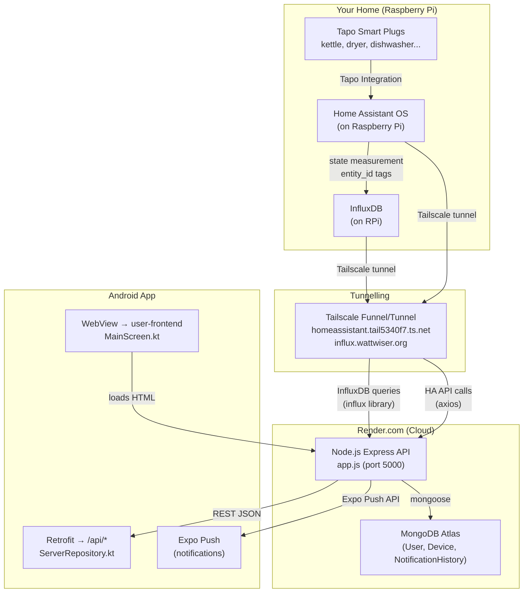
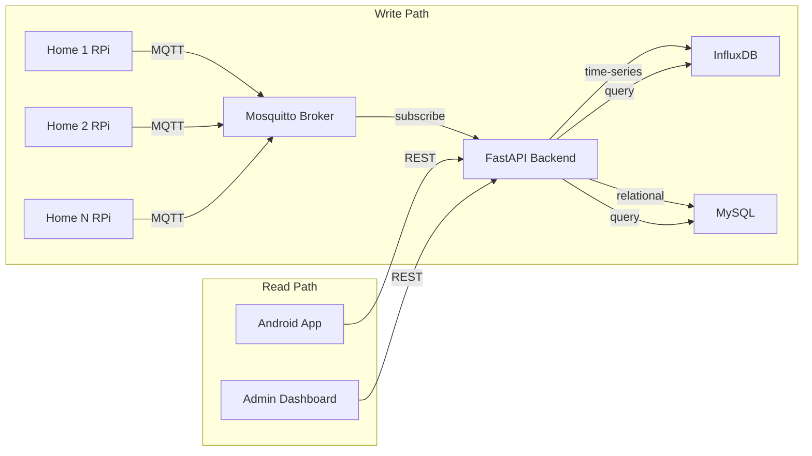
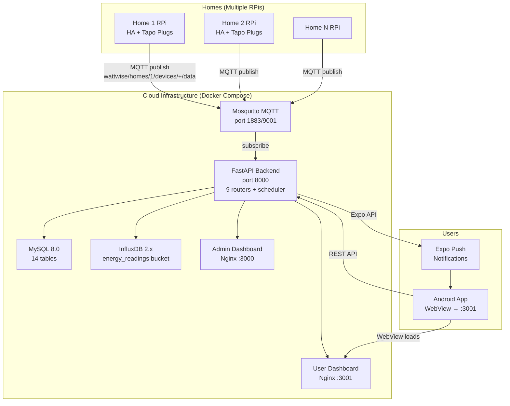

> **DEPRECATED**: This document is a stale duplicate of [ARCHITECTURE.md](ARCHITECTURE.md).
> It has been retained for reference only. Please refer to ARCHITECTURE.md for the current architecture.

---

# WattWise — Full Architecture Analysis & Community Migration Plan

## 1. Current Architecture (Single-Home / Single-User)

### How It Works End-to-End



### Layer Breakdown

| Layer | Technology | Purpose | Where it Runs |
|-------|-----------|---------|---------------|
| **Sensing** | TP-Link Tapo Smart Plugs | Measure power (W), current (A), energy (kWh) per appliance | Your home |
| **Gateway** | Home Assistant OS | Collects Tapo data, exposes entity states via REST API | Raspberry Pi |
| **Time-Series DB** | InfluxDB v1.x | Stores all `"state"` measurement data tagged by `entity_id` | Raspberry Pi |
| **Tunnelling** | Tailscale Funnel | Exposes `influx.wattwiser.org` and `homeassistant.tail*` to internet | RPi → Internet |
| **API Backend** | Node.js Express 5 | Queries InfluxDB + HA API, serves REST endpoints, runs scheduler | Render.com |
| **User Data** | MongoDB (Atlas) | Users, devices, rooms, notification history | Cloud (Atlas) |
| **Mobile App** | Kotlin + Jetpack Compose | WebView loads user-frontend HTML; Retrofit tests connection | User's phone |
| **Notifications** | Expo Push API | Sends alerts (energy spikes, peak tariff, optimization) | Render.com → Expo → phone |

---

### Root-Level Node.js Files (on Render.com)

| File | Purpose |
|------|---------|
| [app.js](file:///c:/Users/suhas/Documents/GitHub/WattWise/app.js) | Express gateway: MongoDB connect, InfluxDB client init, Home Assistant headers, cron scheduler start, routes mount, `/api/ingest-data` endpoint, health check |
| [user-model.js](file:///c:/Users/suhas/Documents/GitHub/WattWise/model/user-model.js) | Mongoose [User](file:///c:/Users/suhas/Documents/GitHub/WattWise/Server%20Side/backend/app/models.py#17-40) schema with embedded `Device[]` (entityId, powerEntityId, switchEntityId) and `Room[]` (entityId) |
| [notification-history-model.js](file:///c:/Users/suhas/Documents/GitHub/WattWise/model/notification-history-model.js) | [NotificationHistory](file:///c:/Users/suhas/Documents/GitHub/WattWise/controllers/user-controller.js#1750-1802) with notification payload, optimization factors (fT/fH/fP), usage data (EAEC, N, duration), 7-day TTL index |
| [user-routes.js](file:///c:/Users/suhas/Documents/GitHub/WattWise/routes/user-routes.js) | 28+ endpoints: auth, device CRUD, device data, room environment, notification history, push tokens, smart notifications, debug entity testing |
| [user-controller.js](file:///c:/Users/suhas/Documents/GitHub/WattWise/controllers/user-controller.js) | 2528 lines: signup/login (JWT 7d), device setup with auto entity-id generation, InfluxDB queries for consumption/historical/hourly/daily, smart notifications with EnergyCalculator |
| [energy-calculator.js](file:///c:/Users/suhas/Documents/GitHub/WattWise/services/energy-calculator.js) | Scenario-based engine: `APPLIANCE_SCENARIOS` (dryer, kettle, etc.), environmental correction factors (fT, fH, fP), efficiency loss calculation, alert generation |
| [notification-scheduler.js](file:///c:/Users/suhas/Documents/GitHub/WattWise/services/notification-scheduler.js) | Cron: hourly full check + 30-min peak check (4–7pm). Per-user: fetch room conditions → per-device usage analysis → optimization → dedup (12h) → Expo push |
| [push-notification-services.js](file:///c:/Users/suhas/Documents/GitHub/WattWise/services/push-notification-services.js) | Expo Push API wrapper: unique `notificationId` + Android `tag` for stacking prevention, bulk send support |

---

### How the Android App Works

The app is a **WebView wrapper** with native settings:

1. **Splash** → animated WattWise logo → navigates to [MainScreen](file:///c:/Users/suhas/Documents/GitHub/WattWise/User%20Apps/Android/IAAUserApp/app/src/main/java/com/iaa/userapp/ui/main/MainScreen.kt#66-327)
2. **MainScreen** → creates `WebView` that loads `fullUrl` (e.g. `https://your-server:3001`)
3. **ServerRepository** → combines DataStore URL + port → Retrofit HEAD test → WebView loads the HTML dashboard
4. **Settings** → user can change server URL/port, saved in DataStore
5. **Notifications** → Expo push token sent to backend via `POST /api/user/push-token`

> **Key insight:** The app is NOT a native REST consumer. All UI comes from the web dashboard HTML served by the backend. The only native code is: connection testing, settings, splash screen, and push notification handling.

---

### Data Flow: Tapo Plug → User Notification

```
Tapo Plug (10s intervals)
  → Home Assistant (entity state update)
    → InfluxDB "state" measurement (entity_id tag)
      → [Tailscale tunnel] → Render.com Node.js
        → notification-scheduler (cron every hour)
          → queries InfluxDB for device usage
          → energy-calculator computes optimization
          → generates notification if threshold met
          → push-notification-service → Expo API
            → Android app receives push
```

---

## 2. Database Storage Strategy

### Current (Single-Home)

| Store | Data | Query Pattern |
|-------|------|--------------|
| **InfluxDB** (RPi) | `"state"` measurement, `entity_id` tag, `value` field | Time-range queries per entity |
| **MongoDB** (Atlas) | Users, embedded devices/rooms, notification history | User lookup, notification dedup |

### Proposed (Community-Level)

| Store | Data | Why |
|-------|------|-----|
| **InfluxDB Cloud** (or self-hosted) | All homes' time-series data, tagged by `home_id` + `entity_id` | Scalable time-series, per-home isolation via tags |
| **MySQL** (existing WattWise schema) | Users, homes, devices, rooms, energy_goals, user_decisions, rankings, notifications, hourly/daily summaries | Relational queries, joins for rankings, PhD research queries |
| **MongoDB** (keep existing) | Legacy notification history, backward compat with existing Node.js | Gradual migration, keep existing data |



---

## 3. Community-Level Architecture Upgrade

### What Changes

| Component | Current (Single-Home) | Community (Multi-Home) |
|-----------|----------------------|----------------------|
| **Data ingestion** | Tailscale tunnel → Node.js InfluxDB query | MQTT broker (each RPi publishes to `wattwise/homes/{home_id}/devices/{device_id}/data`) |
| **Backend** | Node.js Express on Render.com | FastAPI on Docker (already built in `Server Side/`) |
| **User DB** | MongoDB (User + embedded devices) | MySQL (users, homes, devices — relational, supports rankings/goals) |
| **Notifications** | Node.js cron → EnergyCalculator → Expo | FastAPI scheduler → notification_engine.py → Expo |
| **Admin** | None | Admin Dashboard (owner-frontend) with broadcast, rankings, export |
| **Rankings** | None | Community leaderboard (daily/weekly/monthly), efficiency scoring |
| **Goals** | None | Per-user energy goals (daily/weekly/monthly kWh targets) |
| **Decisions** | None | PhD research: user Accept/Defer/Reject on notifications, effectiveness tracking |
| **Android app** | WebView → Node.js served HTML | WebView → FastAPI user-frontend (already built) |
| **CI/CD** | Manual deploy to Render.com | GitHub Actions → Docker images → cloud deploy |

### Target Architecture Diagram



---

## 4. What's Already Built vs. What Still Needs Work

### ✅ Already Built (Server Side/ folder)

| Component | Status | Files |
|-----------|--------|-------|
| Docker Compose stack | ✅ | [docker-compose.yml](file:///c:/Users/suhas/Documents/GitHub/WattWise/Server%20Side/docker-compose.yml) |
| FastAPI backend (9 routers) | ✅ | `backend/app/` (main, config, models, schemas, routers) |
| MQTT ingestion | ✅ | [mqtt_client.py](file:///c:/Users/suhas/Documents/GitHub/WattWise/Server%20Side/backend/app/mqtt_client.py) |
| Energy analysis engine | ✅ | [energy_analysis.py](file:///c:/Users/suhas/Documents/GitHub/WattWise/Server%20Side/backend/app/energy_analysis.py) |
| Decision tracker (PhD) | ✅ | [decision_tracker.py](file:///c:/Users/suhas/Documents/GitHub/WattWise/Server%20Side/backend/app/decision_tracker.py) |
| Notification engine | ✅ | [notification_engine.py](file:///c:/Users/suhas/Documents/GitHub/WattWise/Server%20Side/backend/app/notification_engine.py) |
| Scheduler (8 cron jobs) | ✅ | [scheduler.py](file:///c:/Users/suhas/Documents/GitHub/WattWise/Server%20Side/backend/app/scheduler.py) |
| Admin Dashboard | ✅ | `owner-frontend/` |
| User Dashboard | ✅ | `user-frontend/` |
| MySQL schema (14 tables) | ✅ | [mysql/init/01-schema.sql](file:///c:/Users/suhas/Documents/GitHub/WattWise/Server%20Side/mysql/init/01-schema.sql) |
| Alembic migrations | ✅ | `backend/alembic/` |
| Nginx + Dockerfiles | ✅ | Both frontends |
| CI/CD pipeline | ✅ | [.github/workflows/ci-cd.yml](file:///c:/Users/suhas/Documents/GitHub/WattWise/.github/workflows/ci-cd.yml) |
| Admin data export (CSV/JSON) | ✅ | [routers/export.py](file:///c:/Users/suhas/Documents/GitHub/WattWise/Server%20Side/backend/app/routers/export.py) |
| Android full rebrand | ✅ | Kotlin sources, Gradle |
| **RPi MQTT publisher script** | ✅ | [Sensing Layer/rpi_mqtt_publisher.py](file:///c:/Users/suhas/Documents/GitHub/WattWise/Sensing%20Layer/rpi_mqtt_publisher.py) — 344-line, full MQTT+InfluxDB publisher |
| **MQTT authentication** | ✅ | [mosquitto.conf](file:///c:/Users/suhas/Documents/GitHub/WattWise/Server%20Side/mosquitto/config/mosquitto.conf) `allow_anonymous false` + password_file + [acl.conf](file:///c:/Users/suhas/Documents/GitHub/WattWise/Server%20Side/mosquitto/config/acl.conf) per-home ACL |
| **MQTT password setup script** | ✅ | [mosquitto/scripts/setup_mqtt_passwords.sh](file:///c:/Users/suhas/Documents/GitHub/WattWise/Server%20Side/mosquitto/scripts/setup_mqtt_passwords.sh) |
| **HTTPS/TLS termination** | ✅ | [nginx-proxy/nginx.conf](file:///c:/Users/suhas/Documents/GitHub/WattWise/Server%20Side/nginx-proxy/nginx.conf) — Let's Encrypt + HSTS + rate limiting |
| **Admin password in SQL** | ✅ | [01-schema.sql](file:///c:/Users/suhas/Documents/GitHub/WattWise/Server%20Side/mysql/init/01-schema.sql) — real bcrypt hash `$2b$12$S11M7M...` |
| **Node.js backward compat** | ✅ | `nodejs-api` service in docker-compose + `/legacy/` proxy in Nginx |
| **Android native auth screens** | ✅ | [LoginScreen.kt](file:///c:/Users/suhas/Documents/GitHub/WattWise/User%20Apps/Android/IAAUserApp/app/src/main/java/com/iaa/userapp/ui/auth/LoginScreen.kt) + [SignupScreen.kt](file:///c:/Users/suhas/Documents/GitHub/WattWise/User%20Apps/Android/IAAUserApp/app/src/main/java/com/iaa/userapp/ui/auth/SignupScreen.kt) — Jetpack Compose with JWT |
| **Android push notification handler** | ✅ | [WattWiseFcmService.kt](file:///c:/Users/suhas/Documents/GitHub/WattWise/User%20Apps/Android/IAAUserApp/app/src/main/java/com/iaa/userapp/notifications/WattWiseFcmService.kt) — FirebaseMessagingService + deep-link routing |
| **Android FCM registered in manifest** | ✅ | [AndroidManifest.xml](file:///c:/Users/suhas/Documents/GitHub/WattWise/User%20Apps/Android/IAAUserApp/app/src/main/AndroidManifest.xml) — `<service>` entry for FCM + merged intent-filters |
| **Auth ViewModel + Repository** | ✅ | [AuthViewModel.kt](file:///c:/Users/suhas/Documents/GitHub/WattWise/User%20Apps/Android/IAAUserApp/app/src/main/java/com/iaa/userapp/ui/auth/AuthViewModel.kt) + [AuthRepository.kt](file:///c:/Users/suhas/Documents/GitHub/WattWise/User%20Apps/Android/IAAUserApp/app/src/main/java/com/iaa/userapp/data/repository/AuthRepository.kt) |
| **JWT Token DataStore** | ✅ | [TokenDataStore.kt](file:///c:/Users/suhas/Documents/GitHub/WattWise/User%20Apps/Android/IAAUserApp/app/src/main/java/com/iaa/userapp/data/local/TokenDataStore.kt) — persists JWT across app restarts |
| **Auth API interface** | ✅ | [WattWiseAuthApi.kt](file:///c:/Users/suhas/Documents/GitHub/WattWise/User%20Apps/Android/IAAUserApp/app/src/main/java/com/iaa/userapp/data/remote/WattWiseAuthApi.kt) — Retrofit interface for login/signup/push-token |
| **Nav graph with auth flow** | ✅ | [IAANavGraph.kt](file:///c:/Users/suhas/Documents/GitHub/WattWise/User%20Apps/Android/IAAUserApp/app/src/main/java/com/iaa/userapp/ui/navigation/IAANavGraph.kt) — Splash→Login→Signup→Main flow |
| **Weekly email report** | ✅ | [email_report.py](file:///c:/Users/suhas/Documents/GitHub/WattWise/Server%20Side/backend/app/email_report.py) — HTML+text email, smtplib, APScheduler Mon 08:00 |

### 🔧 Still Needs Implementation

| Item | Priority | Description |
|------|----------|-------------|
| **Production `.env` credentials** | 🔴 HIGH | Replace all `changeme_*` / `REPLACE_*` values with real secrets. Run `python3 scripts/generate_admin_hash.py` for admin password. See [.env.production.template](file:///c:/Users/suhas/Documents/GitHub/WattWise/Server%20Side/.env.production.template) |
| **SMTP credentials in `.env`** | 🟡 MED | Set `SMTP_USER` + `SMTP_PASSWORD` in `.env` to activate weekly email reports (Gmail App Password or SMTP relay) |
| **FCM `google-services.json`** | 🔴 HIGH | Add Firebase project config to `User Apps/Android/IAAUserApp/app/google-services.json` to enable FCM push notifications |
| **Notification drawable** | 🟡 MED | Add `res/drawable/ic_notification_wattwise.xml` (white vector icon) for Android notification tray |
| **Firebase dependency in Gradle** | 🔴 HIGH | Add `google-services` plugin + `firebase-messaging-ktx` to app build.gradle for FCM to compile |
| **MQTT TLS (port 8883)** | 🟡 MED | Uncomment the TLS listener block in [mosquitto.conf](file:///c:/Users/suhas/Documents/GitHub/WattWise/Server%20Side/mosquitto/config/mosquitto.conf) once Let's Encrypt certs are provisioned |
| **DNS setup** | 🟡 MED | Point `app.wattwiser.org`, `admin.wattwiser.org`, `api.wattwiser.org` to cloud VM IP |
| **RPi publisher config** | 🟡 MED | Copy `Sensing Layer/rpi_publisher_config.yaml` to `/etc/wattwise/publisher.yaml` on each RPi and fill in cloud MQTT credentials |

---

## 5. Migration Plan: Single-Home → Community

### Phase A: RPi MQTT Publisher (Each Home)

Create a Python script that runs on each Raspberry Pi:

```
# Each RPi publishes its local InfluxDB data to cloud MQTT
Local InfluxDB → read every 30s → MQTT publish to:
  wattwise/homes/{HOME_ID}/devices/{ENTITY_ID}/data
  payload: { power_watts, current_amps, voltage, energy_kwh, timestamp }
```

This replaces Tailscale tunnels — each home pushes data instead of the cloud pulling it.

### Phase B: Cloud Deployment

1. Deploy Docker Compose stack to your cloud VM (DigitalOcean / AWS / your own server)
2. Set up DNS: `api.wattwiser.org`, `admin.wattwiser.org`, `app.wattwiser.org`
3. Configure HTTPS with Let's Encrypt
4. Set real credentials in [.env](file:///c:/Users/suhas/Documents/GitHub/WattWise/Server%20Side/.env)

### Phase C: Android App Update

1. Update [Constants.kt](file:///c:/Users/suhas/Documents/GitHub/WattWise/User%20Apps/Android/IAAUserApp/app/src/main/java/com/iaa/userapp/util/Constants.kt) → `DEFAULT_SERVER_URL = "https://app.wattwiser.org"`
2. Build release APK (v4.0.0) from the rebranded codebase
3. WebView now loads the new user dashboard from cloud

### Phase D: User Onboarding

1. Admin creates home in admin dashboard
2. User signs up → assigned to home → devices auto-discovered
3. RPi at their home starts publishing → data flows to cloud
4. User gets notifications, sets goals, participates in community rankings

### Phase E: Decommission Node.js Render.com

Once all users are on the new stack, shut down the Render.com Node.js service.

---

## 6. Key Design Decisions

| Decision | Rationale |
|----------|-----------|
| **MQTT push vs. Tailscale pull** | MQTT is fire-and-forget from RPi; scales to N homes without N tunnels |
| **FastAPI over Node.js** | Async Python, built-in OpenAPI docs, better for PhD data analysis |
| **MySQL + InfluxDB dual-DB** | Relational for user/home/ranking queries; time-series for raw telemetry |
| **WebView Android app** | Minimal native code to maintain; dashboard updates without app store releases |
| **Backward compat aliases** | [IAATheme](file:///c:/Users/suhas/Documents/GitHub/WattWise/User%20Apps/Android/IAAUserApp/app/src/main/java/com/iaa/userapp/ui/theme/Theme.kt#83-89), [IAANavGraph](file:///c:/Users/suhas/Documents/GitHub/WattWise/User%20Apps/Android/IAAUserApp/app/src/main/java/com/iaa/userapp/ui/navigation/IAANavGraph.kt#55-58), `IAAApiService` aliases ensure no compilation breaks during gradual migration |

